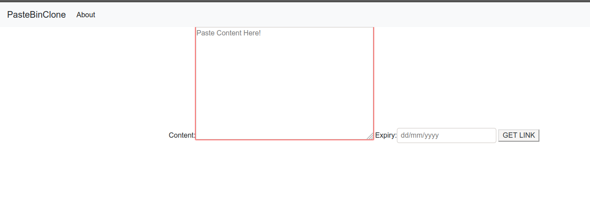
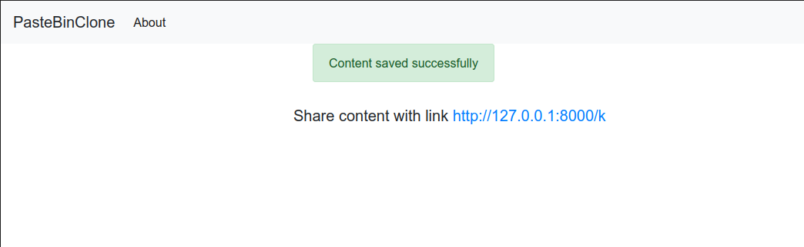
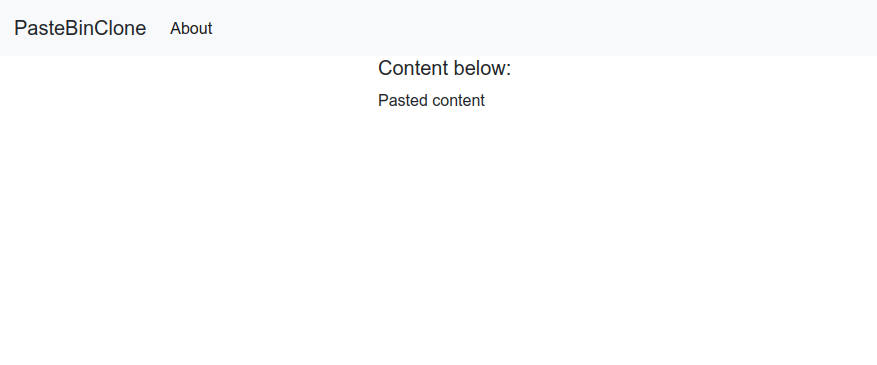

# Pastebinclone
System design fun projects: Implementation of a pastebin clone 

## Preview
Send content
<a href=""></a>

Get shortlink (base 62 encoded url path)
<a href=""></a>

View url content
<a href=""></a>

## Installation

### Prerequisite
* Git
* Working Python3 and Pip3

1. Clone this repo
```bash
git clone https://github.com/oginga/SYS-DESIGN-PLAYGROUND.git
```
2. Change DIR 
```bash
cd pastebinclone 
```
3. Install packages via pip
```bash
pip3 install -r requirements.txt
```
4. Create env variables
```
PB_SECRET_KEY= '<secretkey>'
PB_DEBUG='True'

```
4. Create DB & tables
```bash
python manage.py makemigrations pastebinclone
python manage.py migrate
```
4. Run server
```bash
python manage.py runserver
```

## TODO
* Upload pasted content to an Object store ,file server/aws
* Setup nginx for SSL termination & cache
* Implement Logs & analytics - capture Ips and page clicks
* VUEjs frontend using graphql
* Postgres DB implementation
* Expire overdue pastes.
